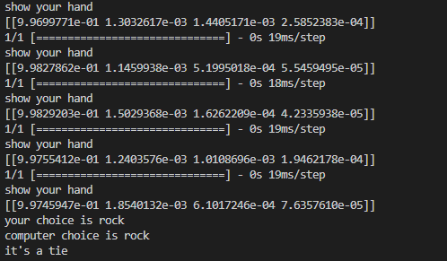

# Computer_Vision
## Hello welcome to my project README file :blush: please have a look

A program to play Rock Paper scissors with your computer.

Technology utilised: python, **tensorflow**, google teachable machine, virtual environment creation, cv2 video capture, Git ... (please check Cam_RPS.py for finished game, details in Milestone 4)

## Milestone 1:

* Using google's teachable machine a machine learing model was created that uses the camera to recognize when then user is holding up a rock, paper or scissors.
* In order to increase the accuracy of the model upto 500 images were uploaded to each category.
* google's teachable machine was chosen due to it being intuitive and easy to use
* This model was saved as keras_model.h5

## Milesone 2:

* a new virtual environment was created using visual studio code, this was done so that the computer could run the machine learning model
* after the model created in milestone 1 was downloaded and input into the right folder `python CVRPS.py` was entered into the terminal to run the model
* The model accessed the webcam and output a vector with 4 values each corresponding with the probability that the user is holding up either a rock, paper, scissors or nothing

The code used to run the mode:
```python
import cv2
#Model is imported
from keras.models import load_model
import numpy as np
model = load_model('keras_model.h5')
cap = cv2.VideoCapture(0)
data = np.ndarray(shape=(1, 224, 224, 3), dtype=np.float32)

while True: 
    ret, frame = cap.read()
    resized_frame = cv2.resize(frame, (224, 224), interpolation = cv2.INTER_AREA)
    image_np = np.array(resized_frame)
    normalized_image = (image_np.astype(np.float32) / 127.0) - 1 # Normalize the image
    data[0] = normalized_image
    prediction = model.predict(data)
    cv2.imshow('frame', frame)
    # Press q to close the window
    print(prediction)
    if cv2.waitKey(1) & 0xFF == ord('q'):
        break
            
# After the loop release the cap object
cap.release()
# Destroy all the windows
cv2.destroyAllWindows()
```

## Milestone 3:

* In milestone 3 a manual version of the rock, paper, scissors game (manual_rps.py) was created where the computer picked an option and then the user was asked to input an option before a winner was selected.

code for game:
```python
import random


# computer randomly selects a choice   
def get_computer_choice():
    choices = ["rock","paper","scissors"]
    computer = random.choice(choices)
    print(f'computer choice is {computer}')
    return computer


# user is asked to input a choice  
def get_user_choice():
    player = input('rock, paper, or scissors?: ').lower()
    return player
 
# The winner is decided after the computer and player have made their decisions   
def get_winner(computer,player):
    if computer == player:
        print("it's a tie")
    elif computer == "rock" and player == 'scissors':
        print("Computer won")
    elif computer == "rock" and player == 'paper':
        print("Player won")
    elif computer == "paper" and player == 'scissors':
        print("Player won")
    elif computer == "paper" and player == 'rock':
        print("Computer won")
    elif computer == "scissors" and player == 'paper':
        print("Computer won")
    elif computer == "scissors" and player == 'rock':
        print("Player won")
    else:
        print('Try again')
    return 
 

# A play function to run the game
def play():
    computer = get_computer_choice()
    player = get_user_choice()
    winner = get_winner(computer,player)
    return
#  The play function is called
play()
```
## Milestone 4:
* The full **final code can be found in Cam_RPS.py**
* The previous manual version of RPS was integrated into a new code where the camera was used to ascertain the user's choice, this was done using **tensorflow** and the model from google's teachable machine in a virtual environment
* The code from milestone 2 was created into a new function in order to turn on the camera and a countdown was added:
```python
def turn_on_cam():
    model = load_model('keras_model.h5')
    cap = cv2.VideoCapture(0)
    data = np.ndarray(shape=(1, 224, 224, 3), dtype=np.float32)
    t_0 = time.time()
    while True: 
        ret, frame = cap.read()
        resized_frame = cv2.resize(frame, (224, 224), interpolation = cv2.INTER_AREA)
        image_np = np.array(resized_frame)
        normalized_image = (image_np.astype(np.float32) / 127.0) - 1 # Normalize the image
        data[0] = normalized_image
        prediction = model.predict(data)
        cv2.imshow('frame', frame)
       
        #creates a countdown in terminal
        elapsed = time.time()-t_0
        
        if 7 <= 10 - elapsed <=8:
            print('get ready!')
        if 6 <= 10 -elapsed <=7:
            print('3!')
        if 5<= 10 -elapsed <=6:
            print('2!')
        if 4<= 10 -elapsed <=5:
            print('1!')
            print(prediction)
        if 10- elapsed <= 4:
            print('show your hand')
            print(prediction)
        if 10 - elapsed <=2:
            break
        if cv2.waitKey(1) & 0xFF == ord('q'):
            break
                
   
    cap.release()
   
    cv2.destroyAllWindows()
    return prediction 
```
* The countdown feature prints a countdown on the terminal before eventually telling the user to 'show your hand,' the user input is then taken 
* Once the countdown reaches 1 an array is printed which shows the probability of the user's sign being either a rock, paper, scissors or nothing

   
* The user choice is then determined using a fucntion which reads the array, within the array the values are rock, paper, scissors and nothing respectively
```python
def Find_user_choice(prediction):
    if (prediction[0][0] > 6e-01) and (prediction[0][1] < 6e-01) and (prediction[0][2] < 6e-01) and (prediction[0][3] < 6e-01):
        player = 'rock'
    elif (prediction[0][1] > 6e-01) and (prediction[0][0] < 6e-01) and (prediction[0][2] < 6e-01) and (prediction[0][3] < 6e-01):
        player = 'paper'
    elif (prediction[0][2] > 6e-01) and (prediction[0][0] < 6e-01) and (prediction[0][1] < 6e-01) and (prediction[0][3] < 6e-01):
        player = 'scissors'
    else: player = 'nothing'
    print(f'your choice is {player}' )
    return player
```
* The function simply reads wich value is higher than 0.6 and then assigns accordingly
* The winner is determined using simple if,elif,else statements with the computer choice being randomly generated.
* A total of 4 rounds were implemeted using a while loop where 1 is consistently added to a variable until it reaches 4 at which point the game ends and a winner is declared
```python
def play_best_of():
    player_wins = 0
    computer_wins = 0
    ties = 0
    rounds = 0
    while rounds < 4:
        winner = play()
        if winner == 'Wplayer':
            player_wins += 1
            print(f'player score is : {player_wins}')
        elif winner == 'Wcomputer':
            computer_wins += 1
            print(f'computer score is : {computer_wins}')
        rounds += 1
    if player_wins == computer_wins:
        print('The game is a draw')
    elif player_wins > computer_wins:
        print('Congrats ')
    else:
        print('You lost')
    return
```
<h1 align="center">Thank you for reading :smile: :blush:</h1>
